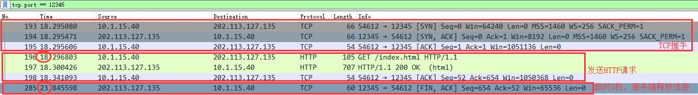

# NanoWebServer
基于NIO实现的WebServer

# 问题记录
## 1. 当MainReactor对同一个SubReactor注册Channel时可能会阻塞MainReactor线程
- 问题原因：因为SubReactor线程调用自己内部维护的Selector的select()来监控Channel时，会提前获取Selector内部SelectionKey的锁，获取以后会挂起并且不释放。
此时MainReactor线程向SubReactor中的Selector注册Channel时，需要获取到Selector内部SelectionKey的锁，而锁被SubReactor持有，所以会阻塞MainReactor。
- ~~临时解决办法： 将select()设置为超时 => select(times)。不过还是有一定概率会阻塞一定时间~~
- 解决办法：注册时获取注册锁，然后唤醒SubReactor，SubReactor向下执行时需要获取注册锁，所以此时MainReactor一定会注册上，注册上之后解锁。

# 功能实现思路
## 1. 长连接
为每一次会话维护一个session对象，当这次会话的请求过来后，更新对应session对象的最后活跃时间，然后再起一个线程检测所有的session，判断当前时间和最后活跃时间的差值是否超时。目前需要完善的超时时间是服务端自己决定的，没有在响应头中告诉客户端
最终的效果如下，因为服务端设置的超时时间是硬编码5秒，所以5秒后(图片上是23 - 18 == 5)，客户端没有新的请求，服务端主动释放连接。

# Finished
- [x] 接收请求返回响应
- [x] 解析HTTP报文
- [x] 处理GET静态请求
- [x] 长连接

# TODO
- [ ] 子Reactor采用线程池
- [ ] 将保活时间添加到响应头 